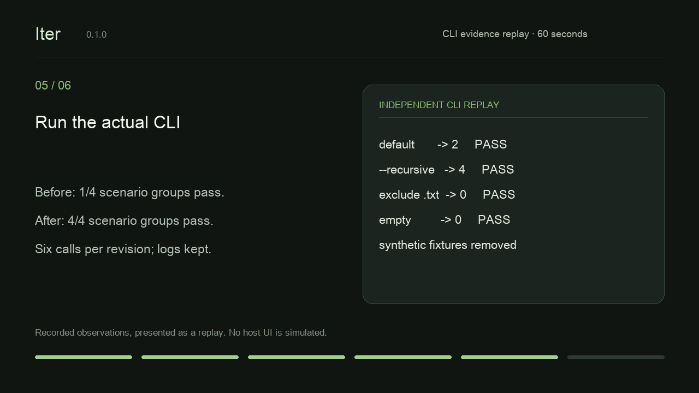

# Note Counter: a complete Iter example

[简体中文](note-counter.zh-CN.md) · [Validation matrix](validation-0.1.0.md)

Iter helps you choose the next improvement and carry the approved scope to an inspectable result. This small example uses a real Python CLI, synthetic data, and saved authorization. It is a local trial, not evidence of product demand.

## One-minute replay

[Watch the 60-second English replay](demo/iter-note-counter.en.mp4).



The video presents recorded observations. It is not a host screen recording or a claim that an iteration finishes in one minute. The English pause and Chinese implementation were separate native sessions; the final CLI replay independently checks the published implementation.

## Input and choice

The [starter](../examples/note-counter/count_notes.py) counts only immediate `.md` files. In an open-ended English Codex session, Iter offered clearer directory errors, optional recursive counting, and case-insensitive extension matching. It recommended error messages; the user chose recursion.

The core of the selected request was:

```text
Use iterate-product to add optional --recursive support for nested .md files.
Default behavior must still count only immediate .md files.
Acceptance: default unchanged, nested Markdown included with --recursive,
.txt excluded, and an empty directory outputs 0.
Metric: local scenario pass rate 100%.
I authorize implementation and creating/removing isolated synthetic fixtures
inside this sample workspace. Preserve logs and reports. Use English.
Do not access the network, install dependencies, read real user data,
change global settings, publish, commit, or build.
```

The English pause variant added: “First record the selected proposal and both grants, then pause before implementation so I can resume in a fresh session.” The saved stage was `research`, both grants were `granted`, and product code stayed unchanged. Fresh sessions resumed the same workspace and completed five scenarios after one time-limited interruption. The original grants stayed byte-for-byte identical; there were no repeated authorization questions. See the validation matrix for the individual attempts and timings.

The Chinese selected-scope trial completed its cycle. It preserved the chosen direction, used Python's standard library, executed the scenarios, recorded the evidence, and reached `complete`. No build was run.

## Change and observations

The [completed implementation](../examples/note-counter-completed/count_notes.py) adds an `argparse` flag and chooses `Path.rglob("*.md")` only when `--recursive` is supplied. The exact lowercase suffix and file checks remain in place.

An independent replay ran both the starter and completed code against fresh synthetic directories, including a path containing spaces:

| Scenario group | Completed CLI observation | Result |
|---|---|---|
| Default mode, nested tree | Prints `2`; nested notes excluded | Pass |
| `--recursive`, same tree | Prints `4`; nested notes included | Pass |
| `.txt`, `.MD`, and a directory named `.md` | Prints `0` in both modes | Pass |
| Empty directory | Prints `0` in both modes | Pass |

The starter passed 1/4 groups because it did not support `--recursive`; the completed example passed 4/4. There were six CLI calls per revision. This independent replay uses a different synthetic tree from the native Chinese trial, which recorded four groups and seven calls; their counts must not be mixed.

Inspect the [machine-readable observations and source hashes](demo/evidence/evidence.json), [exit codes/stdout/stderr transcript](demo/evidence/transcript.txt), and [redacted native session record](demo/native-sessions.json). Synthetic fixture directories were removed; evidence was retained. The replay has no performance benchmark or real-user sample.

## Final report

**Local scenarios passed; real-user value remains unvalidated.**

The approved behavior is implemented and its CLI results are reproducible. Reports and grants remain available for review. Ignore rules, faster large-tree scans, extension changes, and new distribution channels would require their own scope. A completed cycle does not authorize publication.

## Try or reproduce it

Use the [fresh-session instructions](testing.en.md) to run the starter in your own disposable project. To replay the already completed code, run from this repository root with a new output directory:

```sh
python3 scripts/replay-note-counter.py --output /path/to/new-evidence-directory
```

To regenerate the presentation, install Pillow 11.3.0 in an isolated developer environment, provide ffmpeg with libx264 and a font covering the selected language, then run:

```sh
uv run --with pillow==11.3.0 python scripts/render-demo.py --language en --font /path/to/font.ttf --output /path/to/new-demo-directory
```

These are optional presentation tools, not Skill dependencies. The renderer verifies that evidence hashes match the source. The output directory must not already contain the same video or poster. Share feedback on installation, time to first useful result, repeated authorization questions, and where the first cycle stopped using the [trial form](https://github.com/drl990114/Iter/issues/new?template=trial-feedback.yml) after the repository becomes public.
