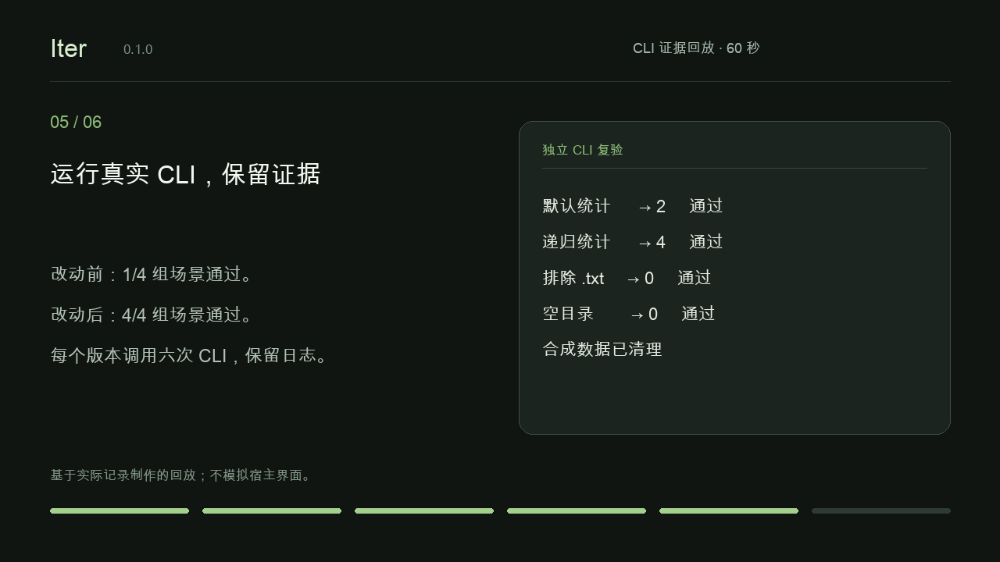

# Note Counter：一个完整的 Iter 案例

[English](note-counter.en.md) · [验证矩阵](validation-0.1.0.md)

Iter 帮你选择下一步，并把批准的改进推进到可核验结果。这个小案例包含真实 Python CLI、合成数据和保存的授权。它是本地试用，不能证明市场需求。

## 一分钟回放

[观看 60 秒中文回放](demo/iter-note-counter.zh-CN.mp4)。



视频基于实际记录制作，不是宿主录屏，也不表示一轮迭代只需一分钟。英文暂停和中文实现来自不同的真实会话；最后的 CLI 复验独立检查了公开案例中的实现。

## 输入与选定方案

[初始代码](../examples/note-counter/count_notes.py)只能统计第一层 `.md` 文件。在一次英文 Codex 开放式会话中，Iter 给出改善目录错误提示、可选递归统计、扩展名忽略大小写三个方案。它推荐先改善错误提示；用户最终选择递归。

中文指定功能请求的核心内容为：

```text
使用 iterate-product，为这个笔记计数器添加可选的 --recursive 参数。
默认仍然只统计第一层 .md；递归包含嵌套 .md，排除 .txt，空目录输出 0。
指标是本机场景通过率 100%。
授权在这个隔离样例中实现上述范围，并只在此工作区创建和清理合成测试数据。
保留日志与报告，用中文完成这一轮。
不要访问网络、安装依赖、读取真实用户数据、修改全局设置、发布、提交或 build。
```

中文真实会话完成了整个周期：沿用用户选择，复用 Python 标准库，实现功能，执行场景，登记证据，最终进入 `complete`。未运行 build。

英文暂停变体要求“先记录选定方案和两类授权，在实现前暂停，稍后用新会话恢复”。保存后阶段为 `research`，实现与本机验证授权均为 `granted`，产品代码保持原样。后续新会话在一次时限中断后完成五个场景，两类原始授权保持完全一致，重复授权询问为 0。各次会话的结果与耗时见验证矩阵。

## 实际改动与结果

[完成后的实现](../examples/note-counter-completed/count_notes.py)新增 `argparse` 参数，仅在传入 `--recursive` 时调用 `Path.rglob("*.md")`，继续保留小写扩展名与文件类型检查。

之后用新的合成目录独立复验初始版和完成版，路径包含空格：

| 场景组 | 完成版 CLI 观察结果 | 结论 |
|---|---|---|
| 默认模式，有嵌套目录 | 输出 `2`，不计入嵌套笔记 | 通过 |
| 同一目录，开启递归 | 输出 `4`，包含嵌套笔记 | 通过 |
| `.txt`、`.MD`、名称以 `.md` 结尾的目录 | 两种模式都输出 `0` | 通过 |
| 空目录 | 两种模式都输出 `0` | 通过 |

初始版因不支持 `--recursive`，通过 1/4 组；完成版通过 4/4 组。每个版本调用六次 CLI。这个独立复验与中文真实会话使用了不同的合成目录；后者是四组、七次调用，两者不能混算。

可检查[结构化观察结果及源码哈希](demo/evidence/evidence.json)、[退出码和输出日志](demo/evidence/transcript.txt)、[脱敏宿主会话记录](demo/native-sessions.json)。合成目录已清理，证据已保留。这里没有性能基准，也没有真实用户样本。

## 最终报告

**本机场景验证通过；真实用户价值待验证。**

批准的行为已实现，CLI 结果可以复现，报告与授权可回看。忽略规则、大目录性能、扩展名行为和新增分发渠道属于后续范围。完成周期不代表获得发布授权。

## 自己试一轮或复现

按照[新会话测试说明](testing.md)，把初始样例复制到一次性项目中。只复验完成版时，在本仓库根目录执行，输出目录需尚不存在：

```sh
python3 scripts/replay-note-counter.py --output /path/to/new-evidence-directory
```

生成中文演示需要可选的开发工具 Pillow 11.3.0、带 libx264 的 ffmpeg，以及覆盖中文的字体：

```sh
uv run --with pillow==11.3.0 python scripts/render-demo.py --language zh-CN --font /path/to/font.ttf --output /path/to/new-demo-directory
```

这些不是 Skill 运行依赖。渲染器会核对证据与源码哈希；输出目录中不能已有同名视频或封面。仓库公开后，通过[试用反馈表](https://github.com/drl990114/Iter/issues/new?template=trial-feedback.yml)记录安装情况、首次有用结果耗时、重复授权次数和首轮卡点。
